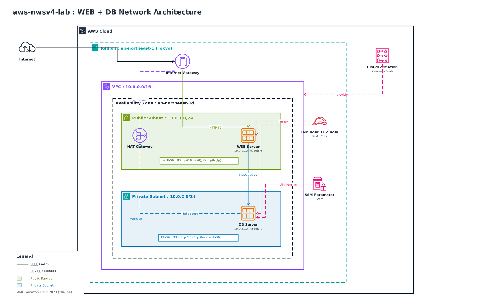

# aws-nwsv4-lab

「基礎からのネットワーク&サーバー構築［改訂4版］」の学習内容を、AWS CloudFormation で再現するためのリポジトリです。


---


## 概要

本リポジトリでは、書籍で構築する AWS ネットワーク・サーバー構成を CloudFormation テンプレートとして管理します。

IaC（Infrastructure as Code）として定義することで、AWS リソース構成の再現性、変更管理、レビューを容易にすることを目的としています。

> **学習目的**: VPC 設計、パブリックサブネット、プライベートサブネット、Internet Gateway、NAT Gateway、セキュリティグループ、EC2、Web / DB 分離構成の理解


---


## アーキテクチャ

以下は、本リポジトリの CloudFormation テンプレートで作成する AWS 構成図です。




---


## 作成される主な AWS リソース

| Resource         | 設定値 / 備考                               |
| ---------------- | -------------------------------------- |
| VPC              | CIDR: `10.0.0.0/16` / DNS ホスト名: 有効     |
| パブリックサブネット       | `10.0.1.0/24`                          |
| プライベートサブネット      | `10.0.2.0/24`                          |
| Internet Gateway | VPC にアタッチ                              |
| NAT Gateway      | パブリックサブネットに配置 / Elastic IP を割り当て       |
| ルートテーブル          | パブリック用・プライベート用                         |
| セキュリティグループ       | Web 用 / DB 用                           |
| IAM ロール          | EC2 用 IAM ロール / SSM Session Manager 対応 |
| EC2 Web サーバー     | Amazon Linux 2023                      |
| EC2 DB サーバー      | Amazon Linux 2023                      |


---


## ディレクトリ構成

```text
.
├── README.md
├── templates/
│   └── aws-nwsv4.yaml
├── parameters/
│   └── aws-nwsv4-lab.example.json
├── diagrams/
│   └── aws-nwsv4-architecture.png
└── docs/
    └── notes.md
```


---


## CloudFormation テンプレート

CloudFormation テンプレートは以下に格納しています。

```text
templates/aws-nwsv4.yaml
```


---


## パラメータファイル

パラメータファイルのサンプルは以下に格納しています。

```text
parameters/aws-nwsv4-lab.example.json
```

実際にデプロイする場合は、サンプルファイルをコピーして使用します。

```bash
cp parameters/aws-nwsv4-lab.example.json parameters/aws-nwsv4-lab.json
```

`parameters/aws-nwsv4-lab.json` には、自分の環境に合わせた値を設定します。

例：

```json
[
  {
    "ParameterKey": "KeyName",
    "ParameterValue": "your-key-name"
  },
  {
    "ParameterKey": "MyIpCidr",
    "ParameterValue": "your-global-ip/32"
  }
]
```

> `parameters/aws-nwsv4-lab.json` は実環境用のファイルのため、GitHub にはコミットしない運用とします。


---


## 前提条件

以下の環境が必要です。

* AWS CLI v2
* AWS CLI の認証設定済み環境
* デプロイ先 AWS アカウント
* デプロイ先リージョン: `ap-northeast-1`
* 既存の EC2 キーペア
* CloudFormation、EC2、VPC、IAM 関連リソースを作成・更新・削除できる IAM 権限


---


## 使い方

### スタック作成

```bash
aws cloudformation create-stack \
  --stack-name aws-nwsv4-lab \
  --template-body file://templates/aws-nwsv4.yaml \
  --parameters file://parameters/aws-nwsv4-lab.json \
  --capabilities CAPABILITY_NAMED_IAM \
  --region ap-northeast-1
```

### スタック状態確認

```bash
aws cloudformation describe-stacks \
  --stack-name aws-nwsv4-lab \
  --region ap-northeast-1
```

### スタック更新

```bash
aws cloudformation update-stack \
  --stack-name aws-nwsv4-lab \
  --template-body file://templates/aws-nwsv4.yaml \
  --parameters file://parameters/aws-nwsv4-lab.json \
  --capabilities CAPABILITY_NAMED_IAM \
  --region ap-northeast-1
```

### スタック削除

```bash
aws cloudformation delete-stack \
  --stack-name aws-nwsv4-lab \
  --region ap-northeast-1
```


---


## セキュリティ

以下の情報は絶対にコミットしないでください。

| 禁止ファイル / 情報                   | 理由                        |
| ----------------------------- | ------------------------- |
| `*.pem`                       | EC2 接続用秘密鍵                |
| `*.key`                       | 秘密鍵ファイル                   |
| `*accesskey*` / `*secretkey*` | AWS 認証情報                  |
| `.env`                        | 環境変数ファイル                  |
| 実環境用パラメータファイル                 | IP アドレスや環境固有情報を含む可能性があるため |
| DB パスワード                      | 認証情報漏洩防止のため               |


これらは `.gitignore` で除外することを推奨します。
万一、AWS アクセスキーや秘密鍵をコミットした場合は、該当キーを即座に無効化・ローテーションしてください。


---


## 補足メモ

学習メモや補足手順は以下にまとめます。
`Confluenceリンクを挿し入れ`

---


